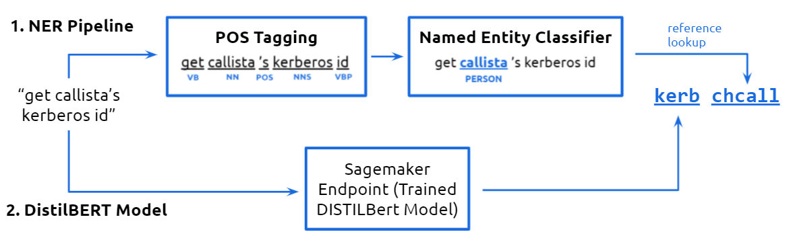

# HackathonGroup4ProjectML

This repository hosts the ML aspect of our project, including data preparation, model training, query pipelines and deployment on AWS Sagemaker.

| Filename                        | Description                                                                 | Platform      |
| ------------------------------- | --------------------------------------------------------------------------- | ------------- |
| DataPreparation.ipynb           | Text augmentation and data transformations, to prepare data for training    | Google Colab  |
| ModelTraining.ipynb             | Training code for DistilBERT with HuggingFace                               | Google Colab  |
| TestingGround.ipynb             | Retrieval of DistilBERT checkpoint, integration with NER pipeline with NLTK | Google Colab  |
| SagemakerTrainingNotebook.ipynb | Deployment of HuggingFace on Sagemaker                                      | AWS Sagemaker |
| train.py                        | Training loop used by AWS Sagemaker                                         | AWS Sagemaker |

# Flowchart

